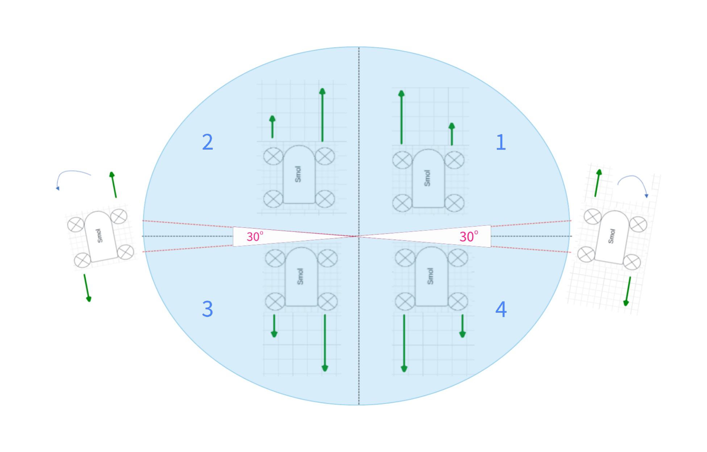

# Arduino pour le projet robot

## Quelle est son utilité?
L'objectif de l'Arduino est de recevoir les commandes envoyées depuis le [serveur](../Server/) via une communication sérielle. L'Arduino exécutera ensuite ces commandes. Il peut s'agir de commandes qui le font avancer, reculer, faire une rotation de $360^\circ$, etc.

Le code utilisé dans ce projet se trouve dans le sous-dossier [Smol_arduino](./Smol_arduino/). 

## Algorithmes de contrôle des roues
Il y a deux algorithmes que nous avons utilisés pour contrôler les moteurs des roues. Il y a un algorithme utilisant un gyroscope et un autre utilisant un joystick. Dans le $1^{er}$ cas, il s'agit des senseurs d'un appareil mobile. Dans le $2^2$ cas, il s'agit d'un joystick logiciel qui utilise l'écran tactile.

### Mode Gyroscope
Le mode gyroscope a été repris tel quel du [Git de Bilal](https://github.com/bilal684/INF8405). Nous l'avons tout simplement déplacé dans un fichier c++ avec des adaptations mineures. Vous pouvez considérer qu'il est tel qu'il nous a été fourni.

### Mode Joystick
Le mode joystick a été ajouté afin de rendre le contrôle du robot plus intéressant et fiable. 

Nous avons implémenté nous-même l’algorithme du joystick, sans s’inspirer de travaux précédents puisque nos recherches là-dessus ont été infructueuses. L'image précédente démontre le comportement général qu’adopte le robot lorsque nous utilisons cet algorithme. L’algorithme reçoit un angle et une puissance. L’angle reflète la direction que prendra le robot. La puissance influence la vitesse des roues. Le cercle bleu représente le cercle trigonométrique. Les quatre cadrans sont séparés par une ligne horizontale et une ligne verticale, les deux en pointillés. Lorsque l’angle est dans le premier cadran, le robot va vers l’avant-droite puisque les roues gauches ont plus de puissance que les roues droites. Dans le deuxième cadran, le robot va vers l’avant-gauche. Puis, vers l’arrière-gauche et vers l’arrière-droite pour les cadrans 3 et 4 respectivement. L’angle et la puissance déterminent la différence de puissance PWM (pulse width modulation) ou vitesse entre les roues.

Donc, selon le cadran, les roues d’un côté sont toujours plus puissantes que celles de l’autre. Par exemple, toujours en se fiant à l'image précédente, dans les $1^{er}$ et $4^{e}$ cadrans, les roues gauches sont plus puissantes que celles de droite (flèches vertes plus longues), mais en sens inverse entre ces deux cadrans (flèches opposées). Dans les $2^{e}$ et $3^{e}$ cadrans, les roues droites sont plus puissantes que celles de gauche. Ceci permet une transition plus douce, soit un tournant progressif. La puissance reçue est considérée pour faire avancer les deux roues à une plus ou moins grande vitesse.

On remarque également deux lignes rouges pointillées. Elles séparent une zone différente dans les cadrans. Nous avons décidé de faire tourner le robot sur lui-même dans ces deux zones de $20^\circ$. Le robot tourne sur lui-même à gauche lorsqu’il est entre $170^\circ$ et $190^\circ$ et sur lui-même à droite lorsqu’il est entre $350^\circ$ et $10^\circ$. En d’autres termes, il effectue un virage de $360^\circ$ dans un sens ou dans l’autre. 

Lorsque l’angle est de $90^\circ$ ou de $270^\circ$, les roues ont la même puissance pour la droite et la gauche. Le robot roule vers l’avant pour un angle de $90^\circ$ et vers l’arrière pour un angle de $270^\circ$. Il est important de considérer que les résultats réels peuvent varier de ce qui est décrit ici. Le matériel peut faire défaut et changer le comportement désiré. Les causes peuvent être l’usure, un bris matériel, une erreur de fabrication des pièces, une mauvaise connexion physique, etc.
