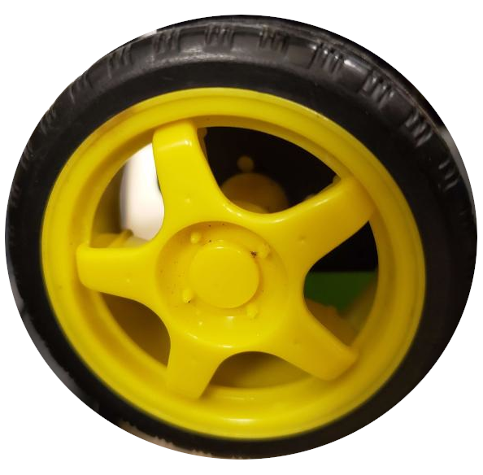

# Smol 
Dans cette section, vous trouverez deux dossiers essentiels au projet robot. Le dossier Smol représente ce que notre équipe a ajouté au projet robot (Hiver 2023). Nous avons également fait des modifications au dossier de l'application mobile.

## Arduino
Le code Arduino que nous avons utilisé pour contrôler les roues   
Ce code a été inspiré du code d'un projet étudiant passé et largement adapté à la réalité de notre projet robot. L'algorithme du gyroscope était déjà présent et n'a pas été modifié. L'algorithme du Joystick est nouveau. Nous l'avons conçu et implémenté entièrement. Celui du servo également.

Afin d'adapter le code Arduino à vos besoins, vous aurez besoin d'installé [l'IDE d'Arduino](https://www.arduino.cc/en/software).

## Server
Le code du serveur qui est exécuté soit sur un ordinateur, soit sur une carte avec un système d'exploitation comme un Raspberry Pi. Nous avons utilisé un Raspberry Pi pour notre projet. Le serveur est codé en [Python](https://www.python.org/downloads/). Assurez-vous de l'avoir installé sur votre machine.

Il a également été partiellement inspiré du travail déjà fait. Encore une fois, plusieurs sections ont été ajoutées et le code de base a été largement modifié.
